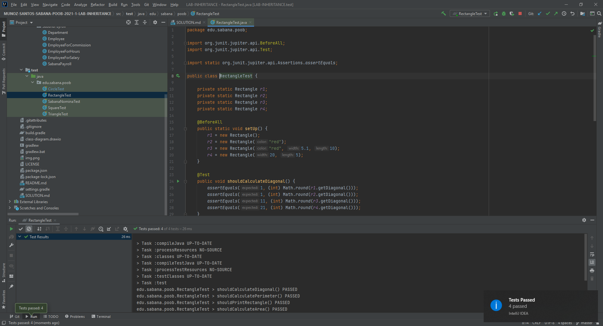
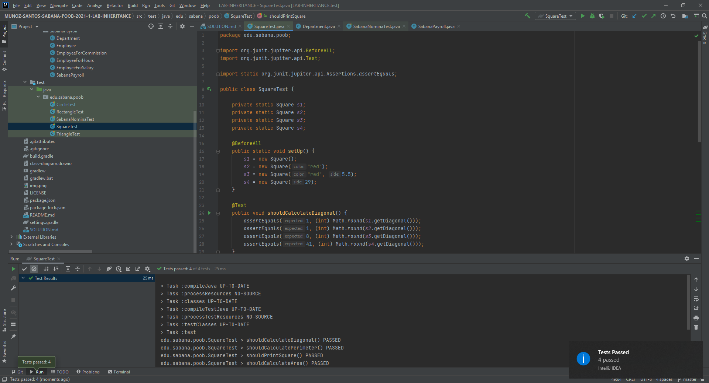
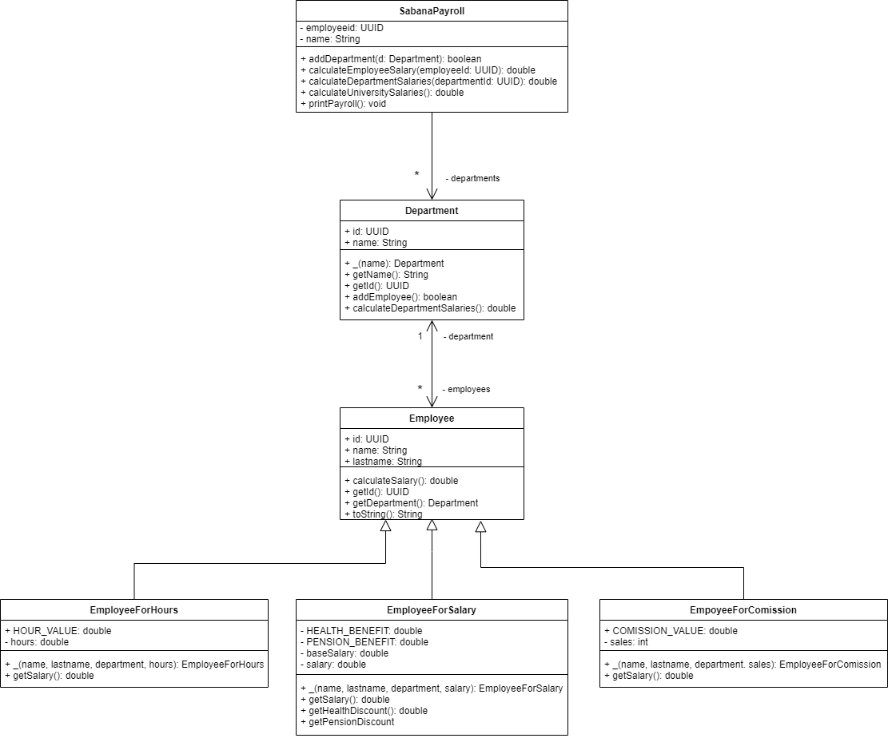
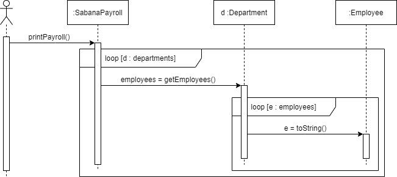
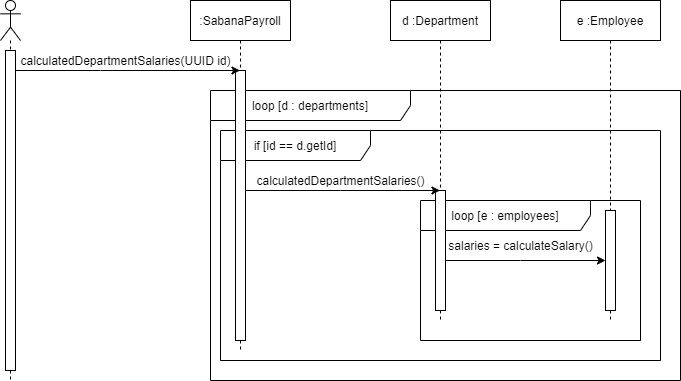

# SOLUTION LAB-INHERITANCE
## Parte I - Entendiendo herencia
### Evidencia

## Parte II - Implementando herencia
### Evidencia Diseño

### Clase `Triangle` Evidencia Test

### Clase `Rectangle` Evidencia Test

 
### Clase `Square` Evidencia Test
 

## Parte III - Diseñando Herencia
### Diseño

## Parte IV - Herencia en un contexto
### Diseños
### `Diagrama de Clases`

### `Diseño printPayroll`

### `Diseño calculateEmployeeSalary`

### `Diseño calculateDepartmentSalaries`

### `Diseño calculateUniversitySalaries`

### Evidencia Tests
